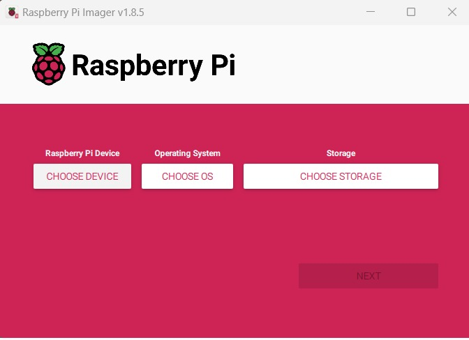
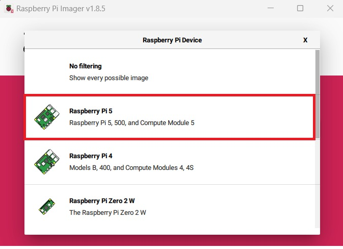
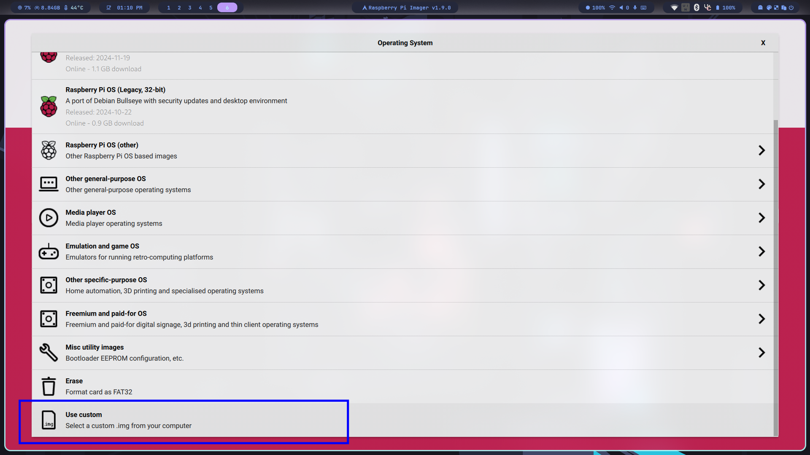
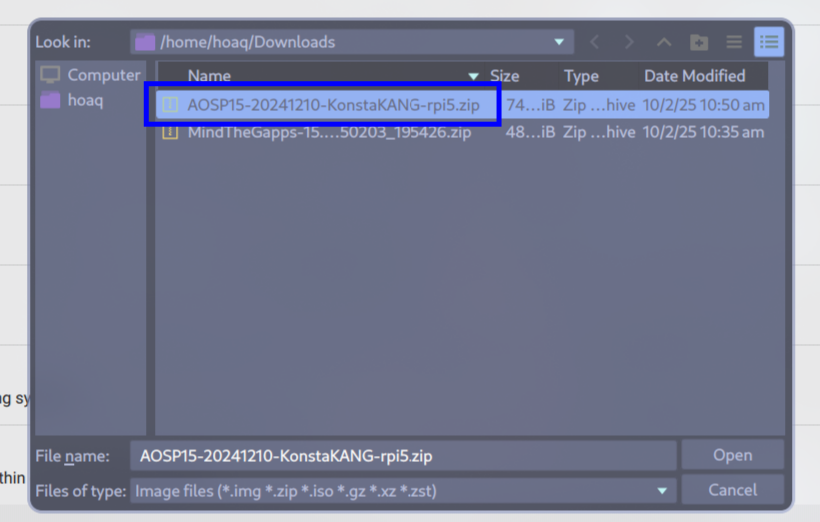
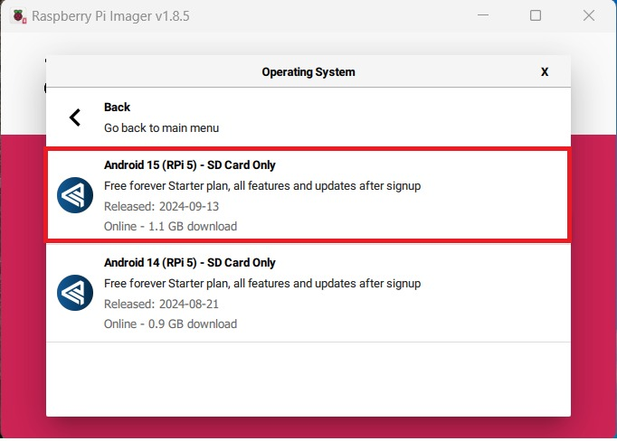
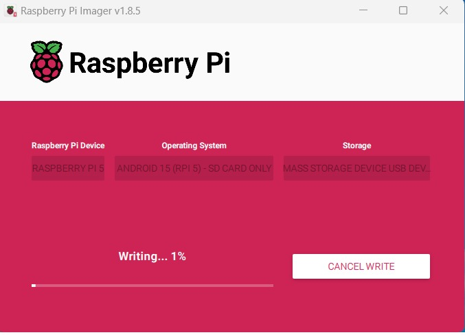

# Android Installation
### Insert SD card and launch RPi Imager
Take your SD card and insert it into your PCs SD card slot or card reader. Open the Raspberry Pi Imager. If prompted, grant any necessary permissions for the application to run.

> Please use a SD card! The OS can not boot from a USB stick.
### Choose Raspberry Pi device 
Select **Raspberry Pi 5.**

### Choose operating system
In the Raspberry Pi Imager, you will see a list of operating systems. Opt for the **Custom OS** option.

### Select Android image file
From the file manager window, select `AOSP15-20241210-KonstaKANG-rpi5.zip`.

### Choose SD card and write image
Click on **Choose storage** and select your SD card. Now, click on **Write.** A dialog box will appear, double-check that you have selected the correct SD card and **Confirm.**

### Wait for write process and verification
The Android OS image will be written to the SD card and automatically verified to ensure the image matches the original. This takes a few minutes. Be patient and do not interrupt the process.

### Insert SD card into Raspberry Pi
Once the success message is displayed, you can safely eject the SD card. Make sure your Pi is powered off before inserting your SD card. Connect your peripherals.
### Power on your Raspberry Pi
Finally, power on your Raspberry Pi. It will boot from the SD card with the newly installed Android OS in place.