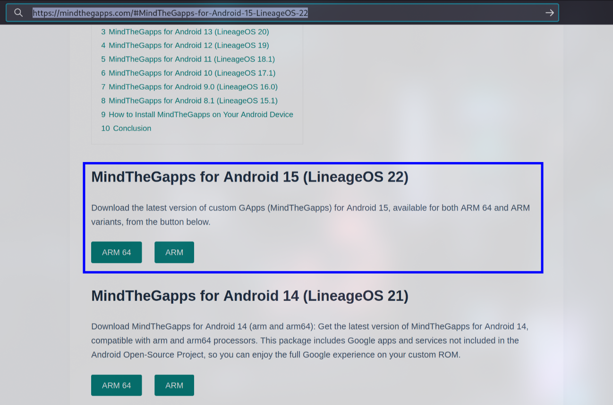
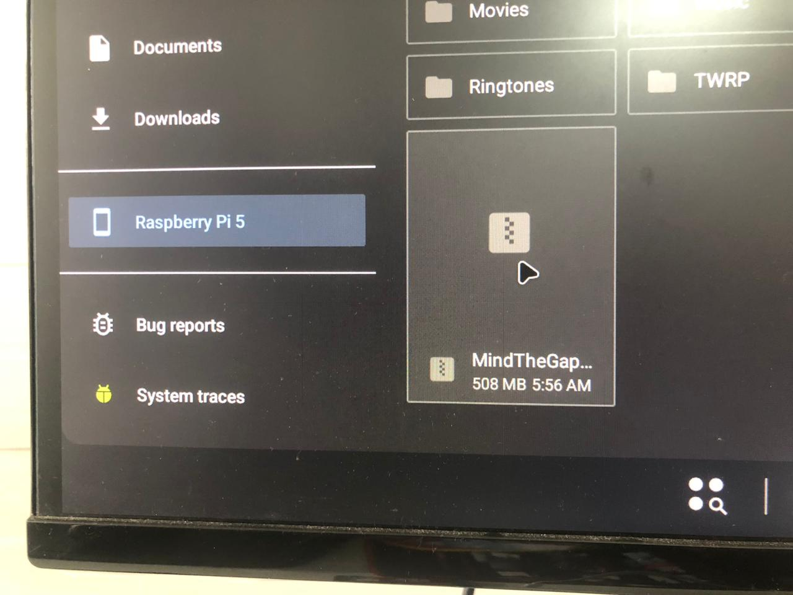
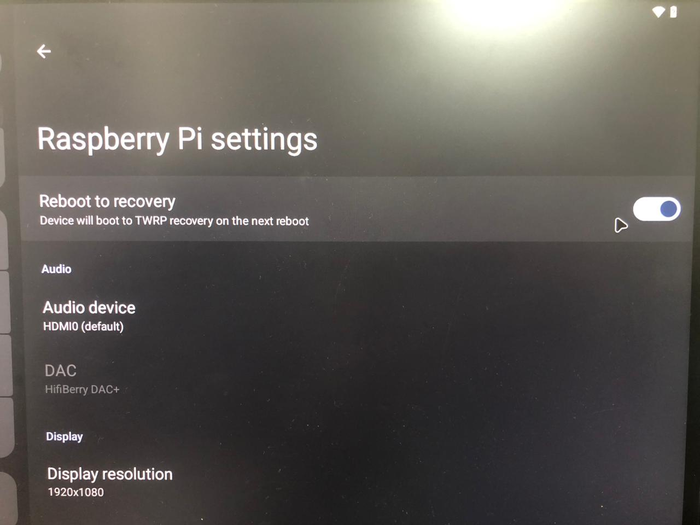
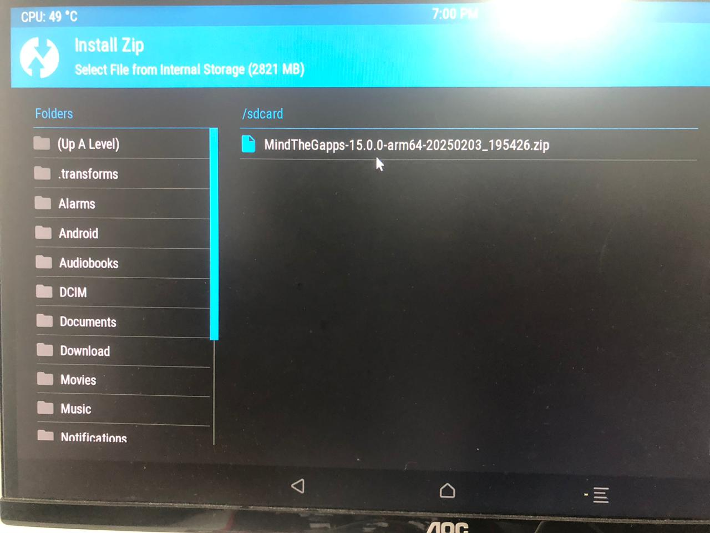
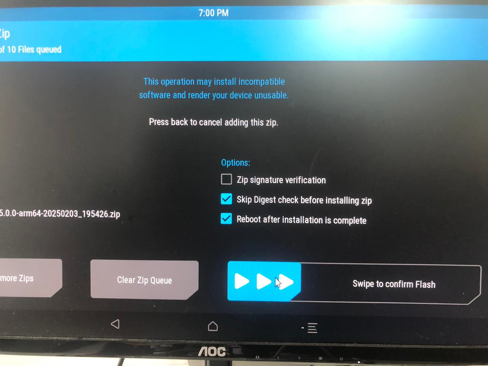
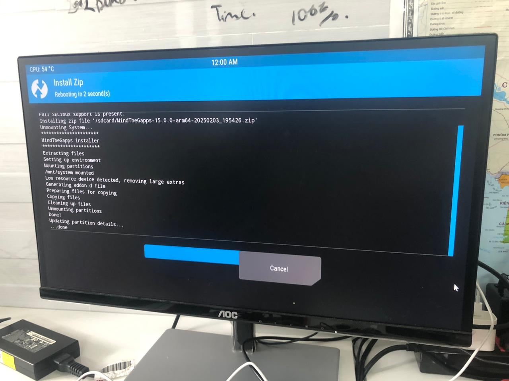
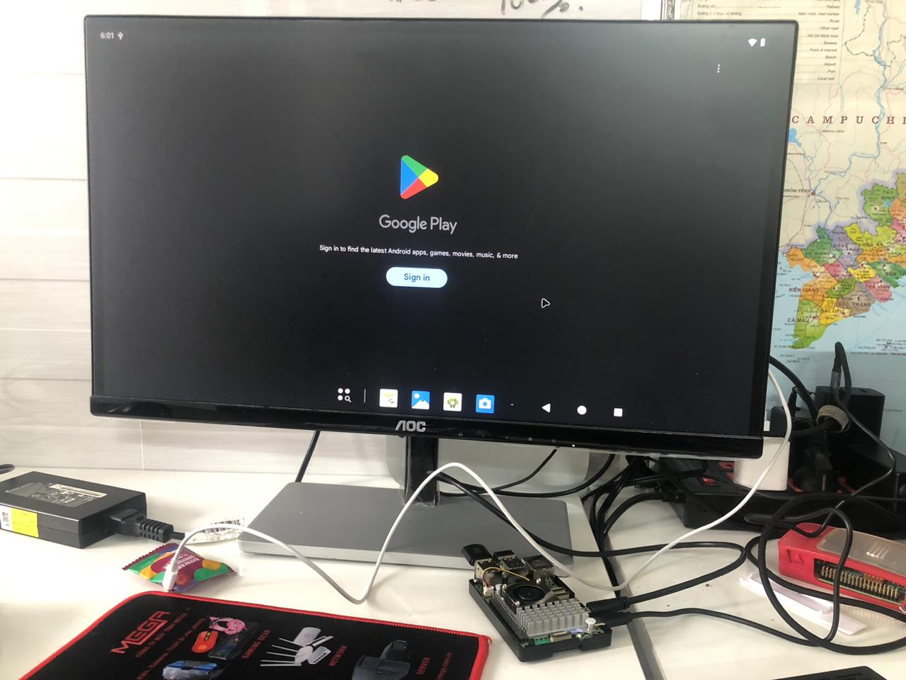

# Install Google Play Services
# Download MindTheGapps package
- Go to [MindTheGapps website](https://mindthegapps.com/#MindTheGapps-for-Android-15-LineageOS-22) and download the Android 15 ARM64 file for install. After downloading, move the file to an external USB device.

# Move the installer file to RPi's internal storage for flashing
- After preparing a USB with the zip file above, connect the USB to Raspberry Pi 5's USB port. Then open the **Files** app on the device and select `Mass Storage Device`. 
- Copy `MindTheGapps-15.0.0-arm64-20250203_195426.zip` to the internal storage.

# Boot into recovery and flash the zip file
- Go to Settings -> System -> Raspberry Pi settings and enable **Reboot to recovery.**

# Flash the zip file in TWRP
- In TWRP, select **Install** then chooes MindTheGapps zip file for flashing. Confirm flash then wait until complete for reboot.

- After auto reboot, Google Play is ready for use.
